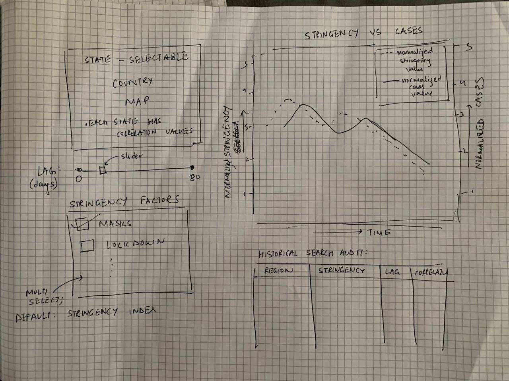

# Final Project Proposal

**GitHub Repo URL**: https://github.com/CMU-IDS-2022/final-project-dunder-mifflin-paper-company

<h3> Team Members </h3>
<ul> 
<li> Bharani Ujjaini Kempaiah - buk@andrew.cmu.edu </li>
<li> Ruben Mampilli - rmampill@andrew.cmu.edu </li>
<li> He-Wei Lee - heweil@andrew.cmu.edu </li>
<li> Kushagra Singh - kushagr2@andrew.cmu.edu </li>
</ul>

<h3> Introduction </h3>
The COVID-19 pandemic has impacted society in various ways, affecting almost every single aspect of our daily lives. 
Though COVID-19 is a crisis worldwide, there have been stark differences in how various regions have approached 
curbing the spread of the infection. Every government has uniquely responded to this pandemic in terms of their masking 
policies, early vaccinations, shutting down schools and workplaces, restricting public transport, etc. 
Variations in these responses are dependent on the distinctive institutional arrangements, political and geographical 
factors, and cultural orientation of each state, and thus, there is no One-Size-Fits-All strategy. 
However, it can also be argued that such distinct policies are a result of the fact that we as a society were grossly 
under-prepared to handle a pandemic of this scale. It is vital that we now analyze the different policies taken to be 
better prepared in the event of a future pandemic.

<h3> Goal </h3>
In this Project, we focus on analyzing how different states in the US approached the COVID-19 pandemic. 
We plan to do this from two different directions. The first would be to analyze from the perspective of the government 
and the containment measures adopted to prevent the spread of COVID. The second will be to look at it form the 
perspective of the citizens and how their behavior in terms of their search trends, mobility levels change through time.
This will enable the viewer to answer questions such as:
  
<ul>
<li> Has COVID-19 infected citizens throughout the country uniformly? 
Have certain states been more affected? </li>

<li> How has the rapid spread of the COVID-19 disease affected the existing 
medical infrastructure? </li>

<li> Does a strict government response (closing schools and workplaces, 
canceling public events, etc.) entail lower morbidity? </li>

<li> Is there a uniform availability of medical infrastructure 
(hospitals, nurses, vaccinations) across the country? Was the current 
medical infrastructure sufficient for the pandemic? If not, how and when 
should governments scale up their medical infrastructure? </li>

<li> Can we predict the spread of infection to help governments plan and 
scale up their resources ahead of time? </li>

<li> Is there a correlation between user searches on vaccination 
related information and spread of COVID cases? </li>
</ul>

Our efforts in building this interactive dashboard will consist of three major phases. The first phase will involve building an interactive visualization that will allow the user to visualize epidemiology data such as cases, deaths, hospitalizations, vaccinations etc. over time. We would also look at visualizing this data across the country by making use of map plots. The second phase will involve detailed analyses and visualization of the responses of the governments and how they dealt with the rise in infection in terms of regulations and status of the healthcare infrastructure. We also plan to explore the behavior of the public in terms of their search trends and level of mobility to understand how they reacted to the ongoing situation. 

We also plan to conduct a correlation analysis of COVID morbidities with other features like mobility, medical infrastructure capacity etc. This will enable us to identify possible strategies that are effective in controlling the spread of COVID-19. On the other hand, we will also explore how user behavior is linked to the spread of COVID cases. One way we plan to do this is by analyzing the correlation between user internet searches about vaccination related information and the spread of COVID in that region. 

The last phase of the project deals with a forecasting model that can predict the number of COVID cases. This can benefit the health sector to timely scale up their infrastructure to deal with increase in cases. Taking this one step further, we can also try to predict the action that must be taken by the government in order to reduce/control the spread of COVID, given the information available.

<h3> Dataset </h3>

We plan on using <a href="https://health.google.com/covid-19/open-data/raw-data"> Covid-19 Open Data </a> as 
the main dataset for this project. 
The repository consists of data relating to demographics, economy, epidemiology, geography, health, 
hospitalizations, mobility, government response, weather, and more. 
The data encompasses multiple important dimensions which can play a key role in suppressing the spread of pandemics, 
such as emergency declarations and official orders from governments, human mobility data, online search trends, etc. 
The data is presented at a fine spatial resolution, using a consistent set of region keys which helps us to conduct 
analyses across geographical regions. 

<h3> Sketches and Data Analysis </h3>

<h4>Data Processing</h4>

As we explored the domain, we decide to use more than just one dataset (<a href='https://healthdata.gov/Hospital/COVID-19-Reported-Patient-Impact-and-Hospital-Capa/g62h-syeh'> Hospital Capacity Data</a>, <a href= "https://healthdata.gov/dataset/COVID-19-Diagnostic-Laboratory-Testing-PCR-Testing/j8mb-icvb"> COVID Testing Data </a> and <a href= "https://healthdata.gov/Health/COVID-19-Public-Therapeutic-Locator/rxn6-qnx8"> COVID Medicine Locator Data</a>) to increase the amount of information we can present.
As a result of this, data processing is required to combine the datasets into a usable format.
Since our main aim is to show the variation of COVID-19 across different states in the Unites States, the main feature by which we join the datasets is the State Name/ID. 
This also requires us to GroupBy the state attribute to get feature values on a state-basis.
There are also numerous instances in which data is missing (NaN). We address this issue by simply omitting those data points.
This is feasible as there are only a very few data points that had missing values. There are also instances in the dataset that include wrong latitude and longitude values for one or two US states which is visible in our EDA process.
We address this issue by removing these abnormal values and replacing it with the mean of the latitude and longitude of the other data points belonging to that US state.
No other data <b>cleaning</b> is required. However, we do perform extensive data transformation steps in order to get the data into a suitable format. 

We plan to derive numerous quantities from the data. While there are existing features related to COVID Cases, Deaths, Vaccinations, Hospitilizations and Testing, we also perform feature engineering methods to derive numerous new features from the existing features.
For example, we plan to divide the <i>number_test_results_completed</i> feature by the <i>number_test</i> feature on a day-to-day basis, as a metric to indicate how delayed are the COVID test results for a particular US state.

We decided to perform all our data preprocessing in a separate script which is executed before the streamlit app is run. 
This script performs all the data preprocessing and writes it to separate .csv files that can be read from the streamlit app.
This decision was made to reduce the latency of the streamlit app as it can now avoid repetition of unnecessary data processing steps.

The current data processing scripts can be found <a href = "https://github.com/CMU-IDS-2022/final-project-dunder-mifflin-paper-company/blob/main/notebooks/data-wrangling-Medical.ipynb"> here </a> and <a href = "https://github.com/CMU-IDS-2022/final-project-dunder-mifflin-paper-company/blob/main/notebooks/data-wrangling.ipynb"> here </a>.
Since the dataset is very large with a large number of columns, we are unable to provide screenshots for all the data processing. However, for reference some screenshots are provided below.

<h4>System Design</h4>

Below we have a few sketches that give an idea of how we would like our COVID-19 dashboard to look. 

### Map Visualizations 

### Medical infrastructure and COVID-19 forecast

### Correlation of cases and stringency

### Correlation of cases and search trends
